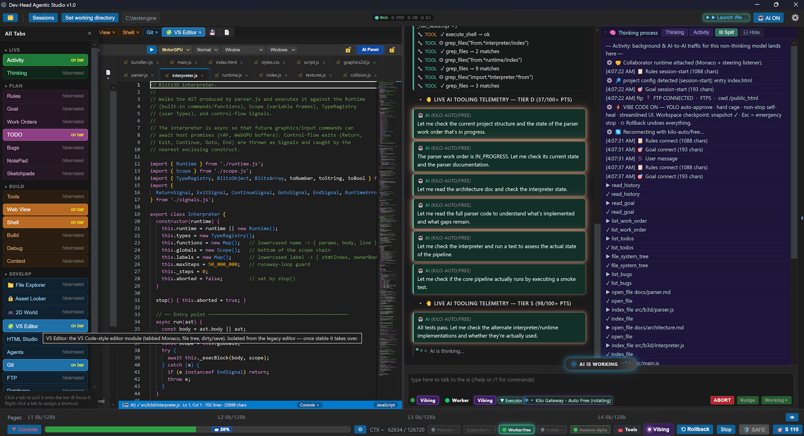
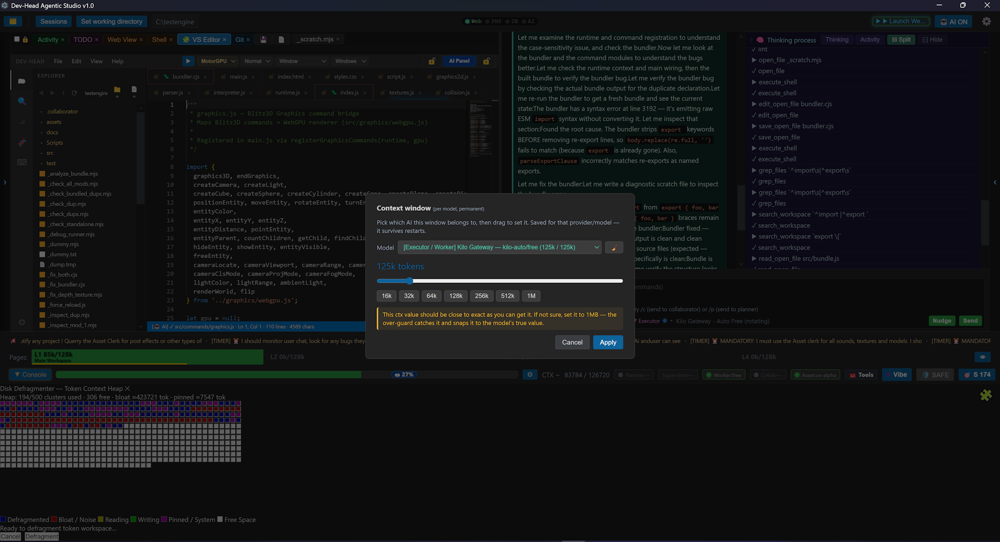

<div align="center">

[](https://pypi.org/project/qai-cli/)
[](https://pypi.org/project/qai-cli/)
[](https://pypi.org/project/qai-cli/)
[](https://pypi.org/project/qai-cli/)
[](https://github.com/Nodoubvt/local-coding-agent/actions/workflows/ci.yml)
[](https://github.com/Nodoubvt/local-coding-agent/stargazers)

</div>

<div align="center">

### <code>uvx qai-cli</code>

**on PyPI** · **[`qai-cli` on PyPI](https://pypi.org/project/qai-cli/)** · **no API key** · **MIT**

</div>

# local-coding-agent

**An offline AI coding assistant that runs entirely on your own machine.**
`qai` is a terminal coding agent powered by **Qwen2.5-Coder 1.5B** running on
[llama.cpp](https://github.com/ggml-org/llama.cpp) — no cloud, no API keys, no
telemetry, no data leaving your laptop.

It is deliberately small: about **1,700 lines** of readable Python you can finish
in one sitting, built to be extended rather than depended on.

> **CLI command:** `qai` · **PyPI package:** `qai-cli` · **Repository:**
> `local-coding-agent` · **License:** MIT

```
qai> add a docstring to every function in utils.py
  tool read_file(path=utils.py)
ok  read_file
  tool edit_file(path=utils.py, old_string=..., new_string=...)
  Approve edit utils.py
  ▸ 12 lines changed
```

---

## Install

### Run it in one command, no virtualenv

```bash
uvx qai-cli
```

Prefer a permanent install? `uv tool install qai-cli`, or `pipx install qai-cli`,
or plain `pip install qai-cli`. All give you the same `qai` command.

**[`qai-cli` is on PyPI](https://pypi.org/project/qai-cli/)** — published from the
`v*` tag via trusted publishing, no API tokens involved.

> **One extra step for local inference.** Actual model running needs
> `llama-cpp-python`, a compiled C++ extension, so it is not pulled in by
> default. You have two options:
>
> **A. No C++ toolchain?** Take the prebuilt CPU wheel, then:
> ```bash
> uvx --with llama-cpp-python qai-cli
> ```
>
> **B. Have a compiler?** Install the extra:
> ```bash
> pip install "qai-cli[local]"
> ```
>
> Without it you still get the CLI, config, sandbox and tool layer — you just
> need to point `--model` at a backend yourself. The first run downloads ~1.1 GB
> of Q4_K_M weights and caches them.

<details>
<summary>Requirements &amp; from-source install</summary>

- Python 3.10 or newer
- ~2 GB free disk for weights, ~2 GB RAM at inference

```bash
git clone https://github.com/Nodoubvt/local-coding-agent
cd local-coding-agent

python -m venv .venv
source .venv/bin/activate          # Windows: .venv\Scripts\activate
pip install -e ".[local]"         # [local] adds llama-cpp-python
```

Inspect resolved settings, or fetch weights ahead of time:

```bash
qai --print-config
python -c "from qai.config import load_settings; from qai.backend import ensure_model_file; print(ensure_model_file(load_settings()))"
```

</details>

## Why this exists

Most "AI coding agent" tools assume a 70B model, a GPU, and a subscription.
This one assumes nothing:

- **Runs a 1.5B model on a laptop CPU.** No CUDA, no 24 GB of VRAM, no
  electricity bill. It is a *small* model, and the tooling around it is built to
  make a small model useful.
- **~1.1 GB download.** Q4_K_M GGUF weights, cached after the first run.
- **1,700 lines, fully readable.** The whole agent — sandbox, tools, approval
  gate, context optimizer — is short enough to read, audit and fork.
- **MIT, no strings.** The safety model is code you can inspect, not a policy
  page.

## Features

- **Local inference** — GGUF weights from Hugging Face, run through
  `llama-cpp-python`. CPU-only works out of the box; GPU offload is on by default
  when a backend exists.
- **Agentic file tools** — `read_file`, `edit_file`, `write_file`, `list_dir`,
  `grep`, all sandboxed to the workspace root.
- **Approval gate** — every write shows a unified diff and waits for you. `--yes`
  skips it, `--read-only` disables writes entirely.
- **32k context with a real optimizer** — tool results and file dumps are trimmed
  head-and-tail, then older turns are auto-compacted into a summary before the
  buffer fills. Tool calls are never orphaned from their results.
- **Context injection** — `@path` mentions, `--attach` globs, and an automatic
  workspace manifest so a 1.5B model knows what files exist.
- **Two modes** — one-shot `qai "..."` for scripting, or a REPL with `@file`
  completion, history and slash commands.

## Requirements

- Python 3.10 or newer
- ~2 GB free disk for weights, ~2 GB RAM at inference
- A C++ toolchain, *or* a prebuilt `llama-cpp-python` wheel (below)

## Install

### Fastest — no install, no virtualenv

```bash
uvx qai-cli              # run it instantly
```

### Global install, still isolated

```bash
uv tool install qai-cli  # or: pipx install qai-cli
qai "what does main() do?"
```

> **Local inference needs `llama-cpp-python`**, a compiled C++ extension. If you
> have no C++ toolchain, use the prebuilt CPU wheel:
>
> ```bash
> pip install llama-cpp-python --extra-index-url https://abetlen.github.io/llama-cpp-python/whl/cpu
> ```
>
> Then run `uvx --with llama-cpp-python qai-cli` to try it in one shot.

### From source

```bash
git clone https://github.com/Nodoubvt/local-coding-agent
cd local-coding-agent

python -m venv .venv
source .venv/bin/activate          # Windows: .venv\Scripts\activate
pip install -e ".[local]"         # [local] adds llama-cpp-python
```

Inspect resolved settings, or fetch weights ahead of time:

```bash
qai --print-config
python -c "from qai.config import load_settings; from qai.backend import ensure_model_file; print(ensure_model_file(load_settings()))"
```

## Usage

```bash
qai                                  # interactive session
qai "why does main() hang here?"     # one-shot
qai "refactor this" -a src/api.py    # attach a file
qai "find every TODO" --no-tools     # pure chat, no filesystem access

qai --model qwen2.5-coder-1.5b-instruct-q8_0.gguf   # higher-quality quant
qai --gpu-layers 0 --threads 8       # force CPU, pin thread count
qai --read-only                      # refuse every write
qai --compact-at 0.5                 # summarize earlier, at 50% of budget
qai --no-compact                     # disable the compactor
```

### REPL commands

| command | effect |
| --- | --- |
| `/help` | show commands |
| `/new` | clear conversation history |
| `/context [path]` | re-send the manifest, or attach specific paths |
| `/stats` | context usage, budget, compaction count |
| `/tools` | list available tools |
| `/model` | show active model and context size |
| `/read-only on\|off` | toggle write access |
| `/exit` | quit (ctrl-d also works) |

## Configuration

Settings merge in this order: **defaults → `config.json` → env vars → CLI flags**.

```bash
python -c "from qai.config import Settings, save_settings; save_settings(Settings(n_ctx=32768))"
```

| setting | default | meaning |
| --- | --- | --- |
| `n_ctx` | `32768` | context window |
| `max_tokens` | `4096` | reply ceiling, also reserved from the budget |
| `compact_threshold` | `0.70` | auto-compact above this context ratio |
| `max_tool_result_chars` | `8000` | per-result trim limit |
| `keep_recent_blocks` | `6` | turns kept verbatim through compaction |
| `auto_compact` | `true` | enable the compactor |
| `n_gpu_layers` | `-1` | `-1` offload all, `0` CPU only |
| `temperature` | `0.2` | sampling temperature |
| `auto_approve` | `false` | skip write approval |

Env equivalents: `QAI_N_CTX`, `QAI_TEMPERATURE`, `QAI_AUTO_COMPACT`,
`QAI_MODEL_DIR`, `QAI_CONFIG_DIR`, and the rest follow `QAI_` + the setting name.

## How the context optimizer works

A 1.5B model with a 32k window still hits the wall fast, because a single
`read_file` of a large file can eat a quarter of it. Three layers keep a long
session degrading instead of failing:

1. **Budget.** `budget = n_ctx - max_tokens - tool_schema_reserve` — 27,472
   tokens at defaults. Everything is measured with a deliberately pessimistic
   chars-per-token estimate, so the agent under-fills rather than overflows.
2. **Trim.** Oversized tool results and `<context>` blocks are cut head-and-tail,
   so the end of an error message survives. Assistant messages carrying
   `tool_calls` are grouped with their results into a single atomic block, so
   trimming can never leave an orphan that breaks the chat template.
3. **Compact.** Past `compact_threshold`, older turns are summarized — by the
   model when it is available, otherwise by a deterministic extractive fallback —
   into a single `<summary>` block, with the last `keep_recent_blocks` turns kept
   verbatim.

Compaction runs between tool rounds, never mid-flight, so the model always sees a
consistent transcript, and the compacted transcript is carried into the next turn
so a long REPL session stays bounded instead of being re-trimmed from scratch
every time. `/stats` shows live usage.

## Safety

- All tool paths resolve through `Workspace`, which refuses anything escaping the
  workspace root after symlink resolution.
- `.git`, `node_modules`, `.venv` and model weights are hidden from listing,
  search and context injection by default; add your own with `--ignore`.
- Writes require explicit approval with a diff shown first.
- `--read-only` disables every mutating tool at the registry level, not just in
  the prompt.

## Development

```bash
pip install -e ".[dev]"
pytest              # 70 tests, no model or network required
ruff check .
mypy src
```

Tests run against a scripted fake backend, so nothing downloads 1 GB. Coverage
includes sandbox escapes, the approval gate, tool-call pairing across trims, and
a simulated 32k session that reads a 20k-line file fifteen times.

## Releasing

Push a `v*` tag. The workflow verifies the tag matches the `pyproject.toml`
version, builds the sdist and wheel, checks metadata, smoke-tests the wheel, and
publishes to PyPI via OIDC trusted publishing — no API token is stored in the
repository.

```bash
# 1. bump version in pyproject.toml + CHANGELOG.md, commit
# 2. tag and push
git tag v0.1.0 && git push origin v0.1.0
```

## License

MIT — see [LICENSE](LICENSE).

---

## Beyond the terminal: Agentic Studio

`qai` and **[Devhead Agentic Studio](https://dev-head.com/products/astudio.html)**
are two different products from the same author, solving the same problem at
different scales. This project is not a trial or a demo of the commercial one —
it is the full, MIT-licensed tool, and it will stay that way.

|  | `qai` (this repo) | Agentic Studio |
| --- | --- | --- |
| Price | Free, MIT | Commercial, perpetual license |
| Interface | Terminal (Windows/macOS/Linux) | Windows desktop IDE |
| Agents | One | Up to five, each with its own model and context budget |
| Default model | Qwen2.5-Coder 1.5B, runs on CPU | Bring your own key, or a bundled local model |
| Context | 32k, with trimming and auto-compaction | Per-model windows from 16k to 1M, with a context inspector |
| Inspectability | Read all 1,700 lines | GUI, plus live payload inspection |
| Best for | Auditing, scripting, small edits, CI | Long autonomous runs, full-stack and 3D work |

**What Agentic Studio adds.** The same context-management ideas from
[the section above](#how-the-context-optimizer-works), built up to multi-agent
scale, plus a number of things a terminal agent deliberately leaves out:

- **Five coordinated agents** — Executor, Planner, Collaborator, Supervisor and
  Asset Clerk. Each slot is independently configurable with its own provider,
  model and context budget, and notes pass between tiers without contaminating
  each agent's window.
- **A visible context engine** — inspect the exact payload sent to the model
  every turn, token by token, with a live gauge for headroom and a heatmap of
  what is pinned, bloated or still free.
- **Embedded runtimes** — PHP 8.3 and MariaDB 11.7, an FTP/SFTP client, a web
  server with hot reload and a PixiJS 2D engine, all inside the editor and all
  exposed to the agent as callable tools.
- **Visual and 3D authoring** — a snap-grid HTML page editor, and a vendored
  PlayCanvas engine (WebGL2/WebGPU, offline) the agent can drive directly.
- **Recovery** — workspace snapshots before and during runs, session restore
  that preserves tree state and agent memory, and one-click rollback.

<p align="center">
  
</p>

<p align="center"><em>Vibe Mode — the workspace is snapshotted first, then the
agent runs unattended with the sandbox still hard-caged. The tool log and L1–L4
context gauges run along the bottom edge.</em></p>

<p align="center">
  
</p>

<p align="center"><em>Per-model context windows from 16k to 1M, with the heap
showing which clusters are pinned, bloating or still free.</em></p>

Agentic Studio is Windows-only for now, requires a free signup, and ships with a
7-day demo before the perpetual license. If you want the graphical version, the
[product page](https://dev-head.com/products/astudio.html) has the details.

*Screenshots are from the author's product page and remain the property of their
respective owner.*
